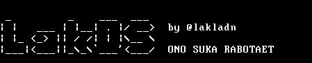

# Lakos OS



Минималистичная учебная ОС для i386. Проект включает ядро, примитивный shell, tar‑базированную rootfs и небольшой набор пользовательских программ.

## Возможности

- загрузка через GRUB (Multiboot)
- текстовый терминал VGA с цветами, boot‑анимацией и информацией о системе
- shell с историей команд и автодополнением
- tar‑файловая система, вшитая в образ (`modules.tar`)
- базовый набор команд: навигация, работа с файлами, диски, пользователи
- простые пользовательские программы (`rootfs/bin`), запуск ELF‑бинарников
- примитивный GUI (команда `gui`)

## Быстрый старт (сборка)

```bash
make iso
```

Артефакты сборки:

- `lakos.bin` — бинарь ядра
- `modules.tar` — архив rootfs
- `lakos.iso` — загрузочный ISO

Очистка:

```bash
make clean
```

## Требования

- `gcc` с поддержкой `-m32` (или `i686-elf-gcc`)
- `binutils`
- `nasm`
- `grub-mkrescue`, `xorriso`

## Как пользоваться в системе

При старте ОС запускается логин. По умолчанию доступен пользователь:

- `root` / `root`

Примеры команд в shell:

- навигация: `pwd`, `ls`, `cd`
- файловые операции: `cat`, `mkdir`, `touch`, `rm`, `cp`, `echo`
- информация: `ver`, `uname`, `date`, `whoami`
- диски: `disks`, `read_sector`, `write_sector`, `mount`
- пользователи: `useradd`, `userdel`, `login`, `passwd`
- крипто: `crypt -e <key> <text>`, `crypt -d <key> <text>`
- прочее: `cls`, `shutdown`, `reboot`, `gui`

Доступные пользовательские программы в `/bin`:

- `hello`
- `test`
- `editor`
- `calc` (простой калькулятор)

## Архитектура проекта

```
boot/        загрузчик и стартовый код
kernel/      ядро, драйверы, shell, GUI
rootfs/      содержимое файловой системы (вшивается в modules.tar)
ass/         ассеты (изображения/иконки)
```

## Авто‑релизы (GitHub Actions)

Workflow `.github/workflows/deploy.yml` автоматически:

1. вычисляет следующий тег версии `vX.Y.Z`;
2. создаёт и пушит тег;
3. собирает `lakos.iso` и `modules.tar`;
4. публикует GitHub Release с артефактами.

## Лицензия

См. [LICENSE](LICENSE).